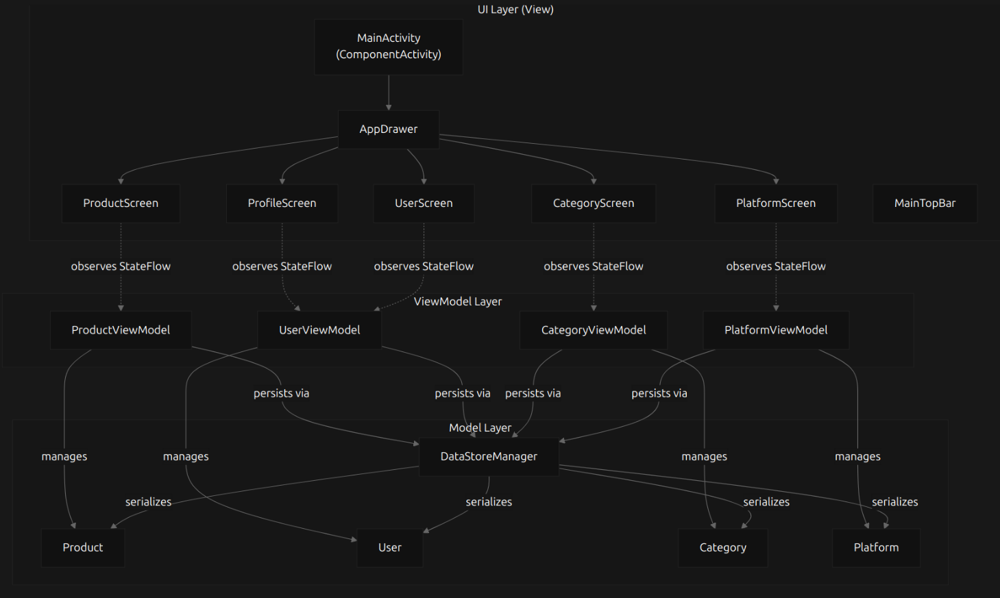

# Level Up - Ecommerce Gaming Platform

## Información del Proyecto

### Nombre de la App
**Level Up** - Plataforma de ecommerce gaming online

### Equipo de Desarrollo

- **Juan Olguin** - Desarrollador Full Stack

## Funcionalidades Principales

### 🎮 App Móvil (Android - Kotlin)
- **Autenticación de Usuarios**
  - Login y registro de usuarios
  - Gestión de perfiles con validación JWT
  - Roles: Administrador, Cliente, Usuario

- **Gestión de Catálogo**
  - Visualización de productos gaming
  - Categorización por tipo de producto
  - Filtrado por plataformas (PS5, Xbox, Nintendo Switch, PC)
  - CRUD completo para administradores

- **Funcionalidades de Usuario**
  - Perfil de usuario personalizable
  - Historial de compras
  - Carrito de compras integrado
  - Gestión offline con DataStore

- **Características Técnicas**
  - Arquitectura MVVM con Repository Pattern
  - Jetpack Compose para UI moderna
  - Retrofit para comunicación con API
  - Kotlin Coroutines para operaciones asíncronas
  - Material Design 3

### 🖥️ Backend - Microservicio de Autenticación (Java Spring Boot)
- **API REST Completa**
  - Autenticación y autorización con JWT
  - Gestión de usuarios, roles y permisos
  - CRUD de productos y categorías
  - Gestión de plataformas gaming

- **Características Técnicas**
  - Spring Boot 3.5.7
  - Spring Security con JWT
  - JPA/Hibernate para persistencia
  - PostgreSQL como base de datos
  - Swagger/OpenAPI para documentación
  - Validación de datos con Bean Validation

## Endpoints API

### 🔐 Autenticación
```
POST /api/auth/login          - Iniciar sesión
POST /api/auth/register       - Registrar usuario
```

### 👥 Usuarios
```
GET    /api/v1/users          - Listar usuarios (Auth requerida)
POST   /api/v1/users          - Crear usuario (Auth requerida)
PUT    /api/v1/users/{id}     - Actualizar usuario (Auth requerida)
DELETE /api/v1/users/{id}     - Eliminar usuario (Auth requerida)
```

### 📦 Categorías
```
GET    /api/v1/categories     - Listar categorías (Auth requerida)
POST   /api/v1/categories     - Crear categoría (Auth requerida)
PUT    /api/v1/categories/{id} - Actualizar categoría (Auth requerida)
DELETE /api/v1/categories/{id} - Eliminar categoría (Auth requerida)
```

### 🎮 Plataformas
```
GET    /api/v1/platforms      - Listar plataformas (Auth requerida)
POST   /api/v1/platforms      - Crear plataforma (Auth requerida)
PUT    /api/v1/platforms/{id} - Actualizar plataforma (Auth requerida)
DELETE /api/v1/platforms/{id} - Eliminar plataforma (Auth requerida)
```

### 🎯 Productos
```
GET    /api/v1/products       - Listar productos (Auth requerida)
POST   /api/v1/products       - Crear producto (Auth requerida)
PUT    /api/v1/products/{id}  - Actualizar producto (Auth requerida)
DELETE /api/v1/products/{id}  - Eliminar producto (Auth requerida)
```

### 🔄 Roles
```
GET    /api/v1/roles          - Listar roles (Auth requerida)
POST   /api/v1/roles          - Crear rol (Auth requerida)
PUT    /api/v1/roles/{id}     - Actualizar rol (Auth requerida)
DELETE /api/v1/roles/{id}     - Eliminar rol (Auth requerida)
```

### 🛒 Endpoints Externos (FakeStore API)
```
GET    https://fakestoreapi.com/carts     - Obtener carritos
GET    https://fakestoreapi.com/carts/{id} - Obtener carrito por ID
POST   https://fakestoreapi.com/carts     - Crear carrito
PUT    https://fakestoreapi.com/carts/{id} - Actualizar carrito
DELETE https://fakestoreapi.com/carts/{id} - Eliminar carrito
```

## Instrucciones de Ejecución

### 📱 Aplicación Android

#### Prerrequisitos
- Android Studio Arctic Fox o superior
- JDK 21
- SDK Android 24+ (Android 7.0)
- Emulador o dispositivo Android

#### Pasos para Ejecutar
1. **Clonar el repositorio**
   ```bash
   git clone [URL_DEL_REPOSITORIO]
   cd final/levelup-kotlin
   ```

2. **Abrir en Android Studio**
   - Abrir Android Studio
   - Seleccionar "Open an existing project"
   - Navegar a la carpeta `levelup-kotlin`

3. **Configurar el proyecto**
   ```bash
   # Hacer el script executable
   chmod +x gradlew
   
   # Sincronizar proyecto
   ./gradlew clean build
   ```

4. **Ejecutar la aplicación**
   - Conectar dispositivo Android o iniciar emulador
   - Presionar el botón "Run" o usar `Shift + F10`

### 🖥️ Microservicio Backend

#### Prerrequisitos
- Java 17 o superior
- Maven 3.6+
- H2 o PostgreSQL (o usar la instancia AWS RDS configurada)

#### Pasos para Ejecutar
1. **Navegar al directorio del microservicio**
   ```bash
   cd final/ms-auth-levelup
   ```

2. **Configurar base de datos** (Opcional - ya configurada AWS RDS)
   - La aplicación está configurada para usar PostgreSQL en AWS
   - Base de datos: `levelup-database.cbqa82ksg6bm.us-east-1.rds.amazonaws.com:5432/postgres`

3. **Ejecutar el microservicio**
   ```bash
   # Usando Maven Wrapper
   ./mvnw spring-boot:run
   
   # O compilar y ejecutar
   ./mvnw clean package
   java -jar target/auth-0.0.1-SNAPSHOT.jar
   ```

4. **Verificar funcionamiento**
   - API Base URL: `http://localhost:5000`
   - Documentación Swagger: `http://localhost:5000/swagger-ui.html`

#### URLs de Producción
- **Backend API**: `http://levelup-back-env.eba-277ppcgy.us-east-1.elasticbeanstalk.com/`
- **Base de datos**: PostgreSQL en AWS RDS

### 🧪 Ejecutar Tests
```bash
# Tests del backend
cd ms-auth-levelup
./mvnw test

# Tests de la app Android
cd levelup-kotlin
./gradlew test
```

## APK y Certificados

### 📱 APK Firmado
- **Ubicación del APK**: `levelup-kotlin/app/release/app-release.apk`
- **Versión**: 1.0 (versionCode: 1)
- **Application ID**: com.example.levelup
- **Tamaño mínimo SDK**: Android 24 (Android 7.0)

### 🔐 Generar APK Firmado - Paso a Paso

#### Método 1: Usando Android Studio (Recomendado)

**Paso 1: Preparar el proyecto**
1. Abrir Android Studio con el proyecto `levelup-kotlin`
2. Asegurarse de que el proyecto compile sin errores
3. Ir a `Build` → `Clean Project` y luego `Build` → `Rebuild Project`

**Paso 2: Crear Keystore (Certificado)**
1. En Android Studio, ir a `Build` → `Generate Signed Bundle / APK...`
2. Seleccionar `APK` y hacer clic en `Next`
3. En "Key store path", hacer clic en `Create new...`
4. Rellenar los datos del keystore:
   ```
   Key store path: /ruta/del/proyecto/levelup-release-key.jks
   Password: [TU_PASSWORD_SEGURO]
   Confirm password: [TU_PASSWORD_SEGURO]
   Alias: levelup-key
   Password: [PASSWORD_DEL_ALIAS]
   Confirm password: [PASSWORD_DEL_ALIAS]
   Validity (years): 25
   
   Certificate:
   First and Last Name: Level Up Team
   Organizational Unit: Development
   Organization: Duoc UC
   City or Locality: Santiago
   State or Province: RM
   Country Code: CL
   ```
5. Hacer clic en `OK`

**Paso 3: Generar APK Firmado**
1. Seleccionar el keystore recién creado
2. Introducir las contraseñas del keystore y alias
3. Hacer clic en `Next`
4. Configurar las opciones de build:
   ```
   Destination Folder: [ruta donde guardar el APK]
   Build Variants: release
   Signature Versions: ✓ V1 (Jar Signature) ✓ V2 (Full APK Signature)
   ```
5. Hacer clic en `Create`
6. Esperar a que termine el proceso de compilación

**Paso 4: Verificar el APK**
- El APK firmado estará en la carpeta especificada
- Verificar que el archivo se ha creado correctamente
- Opcionalmente, instalar en un dispositivo para probar

#### Método 2: Usando Gradle desde Terminal

**Paso 1: Configurar signing en build.gradle.kts**
```kotlin
android {
    signingConfigs {
        create("release") {
            keyAlias = "levelup-key"
            keyPassword = "TU_PASSWORD_ALIAS"
            storeFile = file("../levelup-release-key.jks")
            storePassword = "TU_PASSWORD_KEYSTORE"
        }
    }
    
    buildTypes {
        release {
            isMinifyEnabled = false
            proguardFiles(
                getDefaultProguardFile("proguard-android-optimize.txt"),
                "proguard-rules.pro"
            )
            signingConfig = signingConfigs.getByName("release")
        }
    }
}
```

**Paso 2: Generar APK desde terminal**
```bash
cd levelup-kotlin

# Limpiar proyecto
./gradlew clean

# Generar APK firmado
./gradlew assembleRelease

# El APK estará en: app/build/outputs/apk/release/app-release.apk
```

#### Método 3: Generar Keystore manualmente (Línea de comandos)

**Crear keystore con keytool:**
```bash
keytool -genkey -v -keystore levelup-release-key.jks \
  -keyalg RSA -keysize 2048 -validity 10000 \
  -alias levelup-key \
  -dname "CN=Level Up Team, OU=Development, O=Duoc UC, L=Santiago, ST=RM, C=CL"
```

### 🔒 Información de Seguridad del Certificado
**⚠️ IMPORTANTE**: 
- El archivo `.jks` **NO** está incluido en el repositorio por razones de seguridad
- Las contraseñas deben mantenerse seguras y no compartirse públicamente
- Guardar una copia de seguridad del keystore en un lugar seguro
- Sin el keystore original, no se pueden publicar actualizaciones de la app

### 📋 Verificar APK Firmado
```bash
# Verificar la firma del APK
jarsigner -verify -verbose -certs app-release.apk

# Ver información del APK
aapt dump badging app-release.apk
```

### 📁 Ubicación de Archivos
```
levelup-kotlin/
├── levelup-release-key.jks    # Keystore (NO en repositorio)
├── app/
│   ├── build/outputs/apk/release/
│   │   └── app-release.apk    # APK firmado generado
│   └── release/
│       └── app-release.apk    # APK incluido en el proyecto
```

## Arquitectura del Sistema

### 🏗️ Diagrama de Arquitectura - App Móvil

La aplicación móvil sigue el patrón MVVM (Model-View-ViewModel) con Repository Pattern para una arquitectura limpia y escalable:



### 📐 Patrones Arquitectónicos

#### App Móvil - MVVM + Repository Pattern
```
┌─────────────────┐    ┌─────────────────┐    ┌─────────────────┐
│   UI (Compose)  │ ←→ │   ViewModel     │ ←→ │   Repository    │
│                 │    │                 │    │                 │
│ - Screens       │    │ - UI State      │    │ - Data Sources  │
│ - Components    │    │ - Business Logic│    │ - API Calls     │
│ - Navigation    │    │ - Events        │    │ - Local Storage │
└─────────────────┘    └─────────────────┘    └─────────────────┘
                                                       │
                                               ┌─────────────────┐
                                               │   Data Layer    │
                                               │                 │
                                               │ - Models        │
                                               │ - DataStore     │
                                               │ - Retrofit API  │
                                               └─────────────────┘
```

#### Backend - Arquitectura en Capas (Spring Boot)
```
┌─────────────────┐    ┌─────────────────┐    ┌─────────────────┐
│   Controller    │ ←→ │    Service      │ ←→ │   Repository    │
│                 │    │                 │    │                 │
│ - REST API      │    │ - Business Logic│    │ - Data Access   │
│ - Validation    │    │ - Transactions  │    │ - JPA Queries   │
│ - Error Handling│    │ - Security      │    │ - Entity Mapping│
└─────────────────┘    └─────────────────┘    └─────────────────┘
                                                       │
                                               ┌─────────────────┐
                                               │   Database      │
                                               │                 │
                                               │ - PostgreSQL    │
                                               │ - AWS RDS       │
                                               │ - Entity Models │
                                               └─────────────────┘
```

## Gestión de Proyecto en GitHub

### 🌿 Estrategia de Branching - Git Flow

El proyecto utiliza una estrategia de Git Flow adaptada para desarrollo de características y releases:


#### Tipos de Ramas

- **`master`** 🚀 - Rama principal de producción
  - Contiene código estable y testeado
  - Cada commit representa una versión deployable
  - Protegida con revisión de código

- **`develop`** 🔄 - Rama de desarrollo
  - Integración de características completadas
  - Base para nuevas features
  - Testing de integración

- **`feature/*`** ✨ - Ramas de características
  - `feature/test2` - Implementación de tests y documentación
  - `feature/auth` - Sistema de autenticación
  - `feature/ui` - Interfaz de usuario
  - Se crean desde `develop` y se fusionan de vuelta

- **`hotfix/*`** 🔥 - Corrección de errores críticos
  - Correcciones urgentes en producción
  - Se crean desde `master`
  - Se fusionan a `master` y `develop`

- **`release/*`** 📦 - Preparación de releases
  - Estabilización antes del lanzamiento
  - Corrección de bugs menores
  - Actualización de versiones

### 📊 Historial de Commits

#### Rama `master` (Producción)
```bash
6f2023e6 - fix 2                           (last week)
4f5684f7 - fix                             (last week)  
e6ca96b  - add workflows                    (last week)
73bae7f  - Merge branch 'feat-test'        (last month)
feddeee  - Merge pull request #50          (last month)
1a44cc5  - avance                          (last month)
```

#### Rama `develop` (Desarrollo)
```bash
1a44cc5  - avance                          (last month)
73bae7f  - Merge branch 'feat-test'        (last month)
c063c06  - update checkout repo actions    (Nov 8)
630c173  - update actions                  (Nov 8)
fecee60  - actualizacion de actions        (Nov 8)
36fcd96  - add actions                     (Nov 8)
```

#### Rama `feature/test2` (Características)
```bash
f1ebfbd  - update                          (1 minute ago)
b805384  - add readme                      (3 minutes ago)
a565357  - add nuevos test y docuemntacion (last week)
285e65f  - agregar peticiones a Fake Store Api (last week)
2811ed4  - eliminacion de archivos         (last week)
c6c271e  - add test para modelos           (last week)
```

### 🔄 Workflow de Desarrollo

#### 1. Creación de Feature Branch
```bash
# Desde develop
git checkout develop
git pull origin develop
git checkout -b feature/nueva-caracteristica
```

#### 2. Desarrollo y Commits
```bash
# Commits descriptivos y frecuentes
git add .
git commit -m "add: implementación de autenticación JWT"
git commit -m "fix: corrección en validación de formularios"
git commit -m "test: agregar tests unitarios para AuthService"
```

#### 3. Pull Request y Code Review
```bash
# Push de la rama feature
git push origin feature/nueva-caracteristica

# Crear PR en GitHub:
# feature/nueva-caracteristica → develop
```

#### 4. Merge y Cleanup
```bash
# Después del merge, limpiar rama local
git checkout develop
git pull origin develop
git branch -d feature/nueva-caracteristica
```

### 📈 Estadísticas de Commits por Tipo

#### Análisis de Commits Recientes:
- **Features** (40%): `add nuevos test`, `agregar peticiones a Fake Store Api`
- **Fixes** (25%): `fix 2`, `eliminacion de archivos`
- **Updates** (20%): `update checkout repo actions`, `actualizacion de actions`
- **Merges** (15%): `Merge branch`, `Merge pull request`

### 🛡️ Protección de Ramas

#### Reglas de Protección en `master`:
- ✅ Require pull request reviews before merging
- ✅ Require status checks to pass before merging
- ✅ Require branches to be up to date before merging
- ✅ Include administrators in restrictions

### 🔍 Convenciones de Commits

El proyecto sigue convenciones semánticas para commits:

```bash
# Tipos de commits
feat:     Nueva característica
fix:      Corrección de bug
docs:     Documentación
style:    Formato, puntos y comas faltantes, etc.
refactor: Refactorización de código
test:     Agregar tests
chore:    Mantenimiento
```

#### Ejemplos de Buenos Commits:
```bash
feat(auth): implement JWT token validation
fix(ui): resolve navigation bug in profile screen
docs(readme): add installation instructions
test(models): add unit tests for user model
refactor(api): optimize repository pattern implementation
```

## Estructura del Código

### 📱 App Móvil (`levelup-kotlin/`)
```
app/src/main/java/com/example/levelup/
├── api/                    # Configuración Retrofit y endpoints
├── auth/                   # Gestión de autenticación
├── datastore/              # Almacenamiento local con DataStore
├── model/                  # Modelos de datos
├── repository/             # Capa de repositorio (Repository Pattern)
├── ui/                     # Interfaces de usuario (Jetpack Compose)
│   ├── theme/             # Temas y componentes UI
│   └── ...
├── viewmodel/              # ViewModels (MVVM)
└── MainActivity.kt         # Actividad principal
```

### 🖥️ Microservicio (`ms-auth-levelup/`)
```
src/main/java/com/levelup/
├── config/                 # Configuraciones (Spring, Swagger, etc.)
├── controller/             # Controladores REST
├── dto/                    # Data Transfer Objects
├── model/                  # Entidades JPA
├── repository/             # Repositorios JPA
├── service/                # Lógica de negocio
├── util/                   # Utilidades (JWT, Security)
└── AuthApplication.java    # Clase principal Spring Boot
```

## Tecnologías Utilizadas

### Frontend (Android)
- **Kotlin** - Lenguaje principal
- **Jetpack Compose** - UI toolkit moderna
- **Material Design 3** - Sistema de diseño
- **Retrofit** - Cliente HTTP
- **Kotlin Coroutines** - Programación asíncrona
- **DataStore** - Almacenamiento local
- **Navigation Compose** - Navegación
- **MVVM + Repository** - Arquitectura

### Backend (Microservicio)
- **Java 17** - Lenguaje de programación
- **Spring Boot 3.5.7** - Framework principal
- **Spring Security** - Seguridad y autenticación
- **Spring Data JPA** - Persistencia de datos
- **PostgreSQL** - Base de datos
- **JWT** - Autenticación stateless
- **Swagger/OpenAPI** - Documentación API
- **Maven** - Gestión de dependencias

### Infraestructura
- **AWS Elastic Beanstalk** - Despliegue del backend
- **AWS RDS PostgreSQL** - Base de datos en la nube
- **GitHub Actions** - CI/CD para tests

## Credenciales por Defecto

### Usuario Administrador
- **Email**: admin@duoc.cl
- **Contraseña**: admin123
- **Rol**: administrador

## Enlaces Útiles

- **Repositorio**: [GitHub Repository](https://github.com/JuanOlguinDuoc/levelup-kotlin)
- **API Backend**: http://levelup-back-env.eba-277ppcgy.us-east-1.elasticbeanstalk.com/
- **Documentación API**: http://levelup-back-env.eba-277ppcgy.us-east-1.elasticbeanstalk.com/swagger-ui.html
- **Base de datos**: PostgreSQL en AWS RDS

## Licencia

Proyecto académico desarrollado para Duoc UC - 2025

---

**Desarrollado con ❤️ por Juan Olguin - Duoc UC 2025**

### 📸 Capturas del Historial de GitHub

#### Vista de Commits por Rama:


#### Git Flow Diagram:

